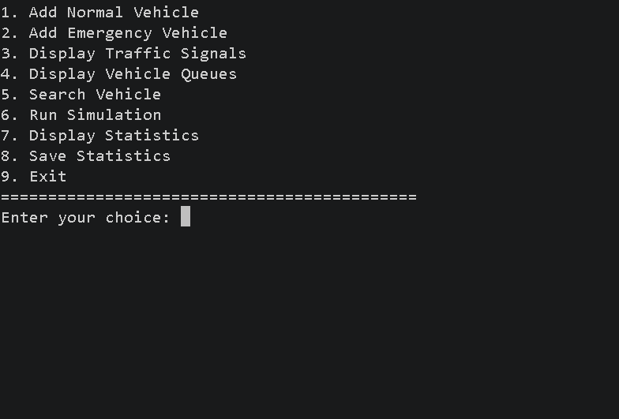
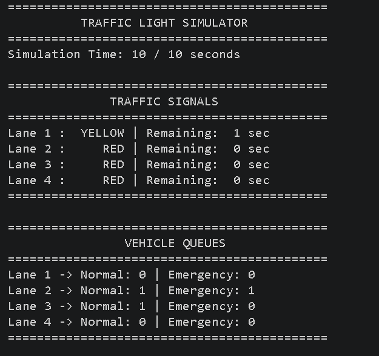
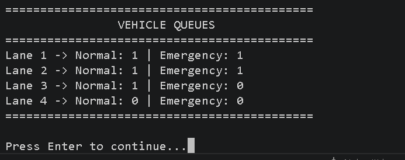
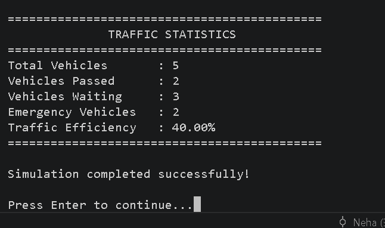

# 🚦 Traffic Light Simulator

A C++ and Data Structures based console application that simulates vehicle flow across a four-lane traffic intersection. The system manages normal and emergency vehicles using FIFO queues and priority queues, controls traffic signals, runs time-based simulations, and generates traffic statistics.

## ✨ Features

- Add normal vehicles to different lanes
- Add emergency vehicles with priority handling
- Manage four independent traffic lanes
- Simulate RED, GREEN, and YELLOW traffic signals
- Process vehicles from the active green lane
- Give emergency vehicles higher priority
- Search vehicles using their unique ID
- Display vehicle queues and traffic signals
- Run time-based traffic simulations
- Calculate vehicles passed, waiting vehicles, and traffic efficiency
- Save simulation statistics to a text file
- Validate invalid user input

## 🧠 Data Structures & Concepts

- **Queue** – FIFO management of normal vehicles
- **Priority Queue** – priority handling of emergency vehicles
- **Vector** – storage of traffic signals and lane queues
- **Unordered Map** – vehicle ID and vehicle type records
- **OOP** – classes, objects, encapsulation, constructors and member functions
- **Enums** – traffic signal states and vehicle types
- **STL** – C++ Standard Template Library
- **File Handling** – saving traffic statistics
- **Multithreading & Timing** – simulation timing using `thread` and `chrono`

## 🛠️ Technologies Used

- C++
- Data Structures & Algorithms
- Object-Oriented Programming
- STL
- File Handling
- VS Code
- Git & GitHub

## ⚙️ How It Works

The simulator contains four traffic lanes. Each lane maintains separate queues for normal and emergency vehicles.

Normal vehicles follow the **FIFO (First In, First Out)** principle using a queue, while emergency vehicles are processed with higher priority using a priority queue.

The traffic signal changes between GREEN, YELLOW, and RED states. During each simulation second, the active green lane processes a vehicle, waiting times are updated, signal timers are decreased, and the traffic signal may change.

## 📊 Statistics

The simulator calculates:

- Total Vehicles
- Vehicles Passed
- Vehicles Waiting
- Emergency Vehicles
- Traffic Efficiency

Traffic efficiency is calculated based on the percentage of vehicles successfully processed during the simulation.

## ▶️ How to Run

### 1. Clone the repository

```bash
git clone https://github.com/Neha-ECE/Traffic-Light-Simulator.git
```

### 2. Navigate to the project directory

```bash
cd Traffic-Light-Simulator
```

### 3. Compile the program

```bash
g++ traffic_light.cpp -o traffic_light
```

### 4. Run the simulator

**Windows:**

```bash
.\traffic_light.exe
```

**Linux/macOS:**

```bash
./traffic_light
```

## 📸 Screenshots

### Main Menu


### Traffic Signal Simulation


### Vehicle Queues


### Traffic Statistics


## 🧠 DSA Concepts Used

- **Queue:** Manages normal vehicles using FIFO (First In, First Out).
- **Priority Queue:** Gives emergency vehicles higher priority for processing.
- **Vector:** Stores and manages vehicle queues for multiple lanes.
- **Unordered Map:** Stores vehicle records and enables fast average O(1) lookup.
- **STL:** Uses C++ Standard Template Library containers and algorithms.
